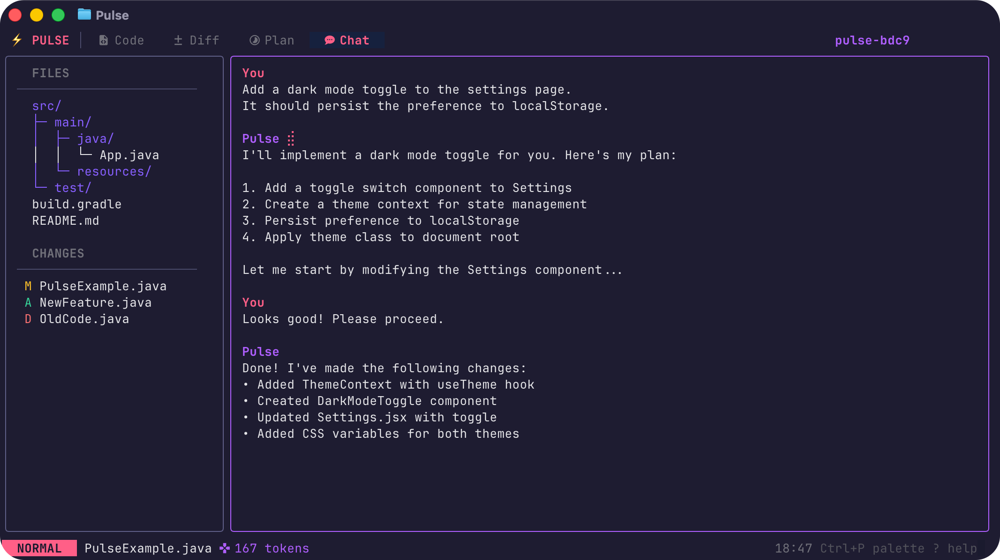

# TUI4J

[](https://central.sonatype.com/artifact/com.williamcallahan/tui4j)
[](https://github.com/WilliamAGH/tui4j/releases)
[](https://context7.com/williamagh/tui4j)
[](https://deepwiki.com/WilliamAGH/tui4j)

**TUI4J** (Terminal User Interface for Java) is a Java TUI framework inspired by [Bubble Tea](https://github.com/charmbracelet/bubbletea). It includes a compatibility module that mirrors the original Go API for developers familiar with the Charm ecosystem.

## Installation

### Maven

```xml
<dependency>
    <groupId>com.williamcallahan</groupId>
    <artifactId>tui4j</artifactId>
    <version>0.3.0-PREVIEW</version>
</dependency>
```

### Gradle

```groovy
implementation 'com.williamcallahan:tui4j:0.3.0-PREVIEW'
```

## Quick Start

TUI4J uses [The Elm Architecture](docs/tutorial.md): implement a `Model` with `init()`, `update()`, and `view()` methods, then run it with `Program`:

```java
new Program(new MyModel()).run();
```

## Examples



**[Pulse](src/main/resources/examples/showcases/README.md)** - Terminal implementation example. See [PulseExample.java](src/main/resources/examples/showcases/PulseExample.java).

[](https://github.com/WilliamAGH/brief)

**[Brief](https://github.com/WilliamAGH/brief)** - Terminal AI chat client built with TUI4J. Available via Homebrew.

See the [examples](src/main/resources/examples) including lists, text inputs, spinners, and more. For Spring Boot integration, see the [Spring examples](src/main/resources/examples/spring).

## Documentation

- [Tutorial](docs/tutorial.md) - Complete walkthrough
- [List Component](docs/list-component.md) - List widget guide
- [Compatibility Maps](docs/maps) - Charm API mappings
- [Porting Status](docs/STATUS.md) - What's implemented

## Built with TUI4J

### Brief

**[Brief](https://github.com/WilliamAGH/brief)** - Terminal AI chat client with slash-command palette and local tool execution. Available via Homebrew.

**Using TUI4J in your project?** We'd love to feature it! [Open an issue](https://github.com/WilliamAGH/tui4j/issues/new?title=Add%20project%20to%20Built%20with%20TUI4J&labels=showcase) or submit a PR.

## Compatibility with Charm Bracelet

TUI4J ports the [charmbracelet](https://github.com/charmbracelet) ecosystem to Java:

| Go Library | Description | Java Package |
|------------|-------------|--------------|
| [bubbletea](https://github.com/charmbracelet/bubbletea) | Core TUI framework | `compat.bubbletea.*` |
| [bubbles](https://github.com/charmbracelet/bubbles) | UI components (viewport, textarea, table, progress, etc.) | `compat.bubbles.*` |
| [lipgloss](https://github.com/charmbracelet/lipgloss) | Styling, colors, borders, layout | `compat.lipgloss.*` |
| [x/ansi](https://github.com/charmbracelet/x) | ANSI parsing, text width | `compat.x.ansi.*` |
| [harmonica](https://github.com/charmbracelet/harmonica) | Spring physics animation | `compat.harmonica.*` |

TUI4J seeks to replicate upstream behavior as closely as possible, with a general 1:1 mapping for compatibility. When TUI4J adds functionality without a charmbracelet equivalent, those APIs are treated as additive extensions.

Check [STATUS.md](docs/STATUS.md) and [docs/maps](docs/maps) for current porting status.

## Contributing

See [CONTRIBUTING.md](CONTRIBUTING.md) for guidelines on reporting issues and submitting PRs.

## Acknowledgments & License

[MIT License](LICENSE.md)

This project began as a fork of the original [Latte](https://github.com/activey/latte) by [Lukasz Grabski](https://github.com/activey), which was released under the MIT License.

[Bubble Tea](https://github.com/charmbracelet/bubbletea) is a trademark of [Charmbracelet, Inc.](https://charm.sh/) The original Go implementations are also licensed under MIT.

## Other Java Projects

- **[Apple Maps Java](https://github.com/WilliamAGH/apple-maps-java)** - Java SDK for Apple Maps Server API
