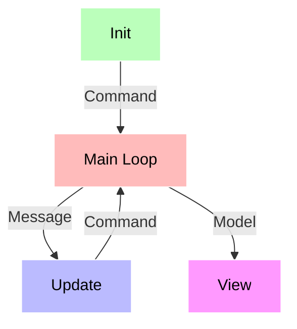

# Latte


> Artwork by [m.art.i](https://www.instagram.com/m.art.i)

Latte is a Java port of Go's [Bubble Tea](https://github.com/charmbracelet/bubbletea), [The Elm Architecture](https://guide.elm-lang.org/architecture/)–driven TUI framework.

Canonical repo: https://github.com/WilliamAGH/latte-v2

This is a maintained fork of the marvelous OG [flatscrew/latte](https://github.com/flatscrew/latte) with bug fixes and improvements welcome and encouraged! Forked version here maintained by [William Callahan](https://williamcallahan.com).


## Installation

### Maven

```xml
<dependency>
    <groupId>io.github.williamagh</groupId>
    <artifactId>latte-tui</artifactId>
    <version>0.2.0</version>
</dependency>
```

### Gradle

```groovy
implementation 'io.github.williamagh:latte-tui:0.2.0'
```

## Examples

See all the [examples](latte-tui-examples) ported so far and some new ones as well!


## Porting Status

Check out [this page](STATUS.md) to see porting status from the original Bubble Tea.

## Tutorial

For this tutorial, we're making a coffee ordering application (the non-annotated source code is available [on GitHub](https://github.com/WilliamAGH/latte-v2/tree/main/latte-tui-examples/src/main/java/org/flatscrew/latte/examples/demo)).

Everything starts with a **model** – an implementation of the `org.flatscrew.latte.Model` interface that describes the application state and three simple methods on that model:

- **init**, a method that returns an initial command for the application to run,
- **update**, a method that handles incoming events and updates the model accordingly,
- **view**, that renders the UI based on the data in the model.



### The Model

So let's start by defining our model which will store our application's state. It can be any type implementing the `org.flatscrew.latte.Model` interface.

```java
import org.flatscrew.latte.Model;

public class Demo implements Model {
    private final static String[] CHOICES = {"Espresso", "Americano", "Latte"};

    private int cursor;
    private String choice;
}
```

### Initialization

Next, we'll define our application's initial state. In this case, we're defining a variable pointing to a model instance; we could just as easily define a method to return our initial model, too.

```java
Demo demoModel = new Demo();
```

Next, we implement the `init` method. It can return a `Command` that could perform some initial I/O. For now, we don't need to do any I/O, so for the command, we'll just return `null`, which translates to "no command".

```java
@Override
public Command init() {
    return null;
}
```

### The Update Method

Next up is the update method. It is called when "things happen". Its job is to look at what has happened and return an updated model in response. It can also return a `Command` to make more things happen, but for now don't worry about that part.

In our case, when a user presses the down arrow, `update`'s job is to notice that the down arrow was pressed and move the cursor accordingly (or not).

The "something happened" comes in the form of a `Message`, which can be any type that implements the `org.flatscrew.latte.Message` interface. Messages are the result of some I/O that took place, such as a keypress, timer tick, or a response from a server.

We usually figure out which type of `Message` we received with a regular if, but you can obviously come up with a more sophisticated switch.

For now, we'll just deal with `KeyPressMessage` messages, which are automatically sent to the update function when keys are pressed.

```java
@Override
public UpdateResult<? extends Model> update(Message msg) {
    // is this a key press?
    if (msg instanceof KeyPressMessage keyPressMessage) {
        // cool, what was the actual key pressed?
        return switch (keyPressMessage.key()) {
            // the "up" and "k" keys move the cursor up
            case 'k', 'K', 65 -> new UpdateResult<>(this.moveUp(), null);

            // the "down" and "j" keys move the cursor down
            case 'j', 'J', 66 -> new UpdateResult<>(this.moveDown(), null);
            
            // the "enter" and the spacebar (a literal space) toggle
            // the selected state for the item that the cursor is pointing at.
            case 13, ' ' -> new UpdateResult<>(this.makeChoice(), QuitMessage::new);
            
            // this key should exit the program
            case 'q', 'Q' -> new UpdateResult<>(this, QuitMessage::new);
            default -> new UpdateResult<>(this, null);
        };
    }

    // return the updated model to Latte for processing
    return new UpdateResult<>(this, null);
}

private Model moveUp() {
    if (cursor - 1 < 0) {
        cursor = CHOICES.length - 1;
        return this;
    }
    cursor--;
    return this;
}

private Model moveDown() {
    if (cursor + 1 >= CHOICES.length) {
        cursor = 0;
        return this;
    }
    cursor++;
    return this;
}

private Model makeChoice() {
    for (int index = 0; index < CHOICES.length ; index++) {
        String choice = CHOICES[index];
        if (index == cursor) {
            this.choice = choice;
            return this;
        }
    }
    return this;
}
```

You may have noticed that `q` above returns a `QuitMessage` command with the model. That's a special message which instructs the Latte runtime to quit, exiting the program.

### The View Method

At last, it's time to render our UI. Of all the methods, the view is the simplest. We look at the model in its current state and use it to return a `String`. That String is our UI!

Because the view describes the entire UI of your application, you don't have to worry about redrawing logic and stuff like that. Latte takes care of it for you.

```java
@Override
public String view() {
    StringBuilder buffer = new StringBuilder();
    buffer.append("What kind of Coffee would you like to order?\n\n");

    for (int index = 0; index < CHOICES.length; index++) {
        if (cursor == index) {
            buffer.append(SELECTION.render("[•]", CHOICES[index]));
        } else {
            buffer.append("[ ] ").append(CHOICES[index]);
        }
        buffer.append("\n");
    }
    buffer.append("\n(press q to quit)");
    return buffer.toString();
}
```

### All Together Now

The last step is to simply run our program. We pass our initial model as an argument for a new instance of `org.flatscrew.latte.Program` and call the `run` method.

```java
public static void main(String[] args) {
    Demo demoModel = new Demo();
    Program program = new Program(demoModel);
    program.run();

    if (demoModel.getChoice() == null) {
        return;
    }
    System.out.printf("\n---\nYou chose: %s!\n", demoModel.getChoice());
}
```

## Contributing

Found a bug or have a feature request? Please [open an issue](https://github.com/WilliamAGH/latte-v2/issues/new) on GitHub. Contributions and feedback are welcome, and Pull Requests (PRs) are encouraged!

## Acknowledgments

This project is a fork of [flatscrew/latte](https://github.com/flatscrew/latte) by [Lukasz Grabski](https://github.com/activey). The original work is an excellent Java port of Go's [Bubble Tea](https://github.com/charmbracelet/bubbletea) by [Charm](https://charm.sh/).

## License

[MIT License](LICENSE) - see the LICENSE file for details.
