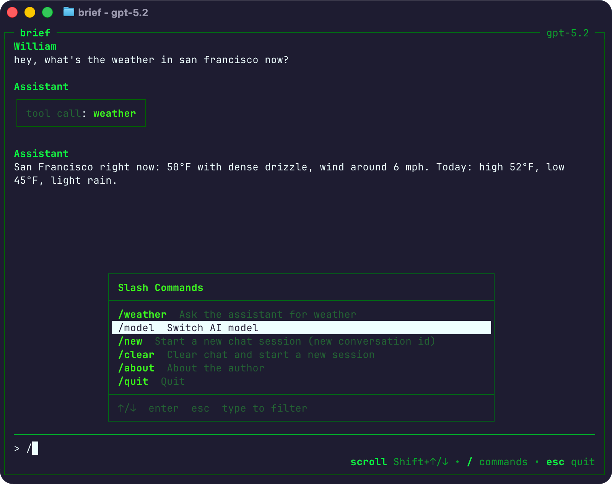

# TUI4J

[](https://central.sonatype.com/artifact/com.williamcallahan/tui4j)

**TUI4J** (Terminal User Interface for Java) is a Java TUI framework inspired by [Bubble Tea](https://github.com/charmbracelet/bubbletea). It includes a compatibility module that mirrors the original Go API for developers familiar with the Charm ecosystem.

This is a maintained fork of the original [Latte](https://github.com/flatscrew/latte) with bug fixes and improvements welcome and encouraged! Fork maintained by [William Callahan](https://williamcallahan.com).

## Installation

### Maven

```xml
<dependency>
    <groupId>com.williamcallahan</groupId>
    <artifactId>tui4j</artifactId>
    <version>0.2.5</version>
</dependency>
```

### Gradle

```groovy
implementation 'com.williamcallahan:tui4j:0.2.5'
```

## Quick Start

TUI4J uses The Elm Architecture: define a model with `init()`, `update()`, and `view()` methods:

```java
import com.williamcallahan.tui4j.compat.bubbletea.*;

public class Counter implements Model {
    private int count = 0;

    @Override
    public Command init() {
        return null;
    }

    @Override
    public UpdateResult<? extends Model> update(Message msg) {
        if (msg instanceof KeyPressMessage key) {
            return switch (key.key()) {
                case "k" -> new UpdateResult<>(increment(), null);
                case "j" -> new UpdateResult<>(decrement(), null);
                case "q" -> new UpdateResult<>(this, QuitMessage::new);
                default -> new UpdateResult<>(this, null);
            };
        }
        return new UpdateResult<>(this, null);
    }

    @Override
    public String view() {
        return "Count: " + count + "\n\n(j/k to change, q to quit)";
    }

    private Counter increment() { count++; return this; }
    private Counter decrement() { count--; return this; }

    public static void main(String[] args) {
        new Program(new Counter()).run();
    }
}
```

See the [Tutorial](docs/tutorial.md) for a complete walkthrough.

## Examples


See all the [examples](examples) including lists, text inputs, spinners, and more:


## Built with TUI4J

### Brief

[](https://github.com/WilliamAGH/brief)

**[Brief](https://github.com/WilliamAGH/brief)** - Terminal AI chat client with slash-command palette and local tool execution. Available via Homebrew.

---

**Using TUI4J in your project?** We'd love to feature it! [Open an issue](https://github.com/WilliamAGH/tui4j/issues/new?title=Add%20project%20to%20Built%20with%20TUI4J&labels=showcase) or submit a PR.

## Compatibility with Bubble Tea

TUI4J includes a compatibility layer for Bubble Tea, which is a trademark of Charmbracelet, Inc. The original Go implementation is licensed under MIT.

TUI4J seeks to replicate [charmbracelet/bubbletea](https://github.com/charmbracelet/bubbletea) behavior as closely as possible, with a general 1:1 mapping for compatibility. When TUI4J adds functionality without a Bubble Tea equivalent, those APIs are treated as additive extensions.

Check [STATUS.md](STATUS.md) for current porting status.

## Contributing

See [CONTRIBUTING.md](CONTRIBUTING.md) for guidelines on reporting issues and submitting PRs.

## Acknowledgments

This project began as a fork of the original Latte by [Lukasz Grabski](https://github.com/activey). The original work is an excellent Java port of Go's [Bubble Tea](https://github.com/charmbracelet/bubbletea) by [Charm](https://charm.sh/).

## License

[MIT License](LICENSE.md)
