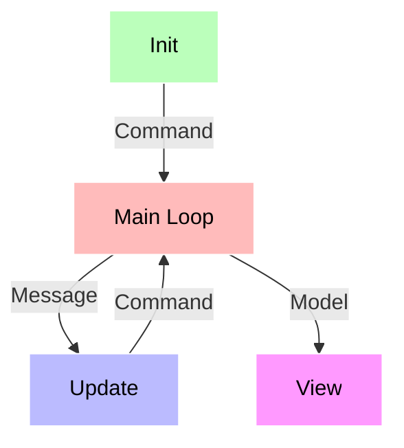

# TUI4J Tutorial

This tutorial walks through building a simple coffee ordering application using TUI4J's Elm Architecture pattern. The complete source code is available in the [examples directory](https://github.com/WilliamAGH/tui4j/tree/main/examples/generic/src/main/java/com/williamcallahan/tui4j/examples/demo).

## The Elm Architecture

TUI4J follows The Elm Architecture, where everything starts with a **model** that implements the `Model` interface. The model describes your application state and provides three methods:

- **init** - Returns an initial command for the application to run
- **update** - Handles incoming events and updates the model accordingly
- **view** - Renders the UI based on the current model state



## Step 1: Define the Model

The model stores your application's state. It can be any class implementing `Model`:

```java
import com.williamcallahan.tui4j.compat.bubbletea.Model;
import com.williamcallahan.tui4j.compat.bubbletea.lipgloss.Style;
import com.williamcallahan.tui4j.compat.bubbletea.lipgloss.color.Color;

public class Demo implements Model {
    private final static Style SELECTION = Style.newStyle().foreground(Color.color("205"));
    private final static String[] CHOICES = {"Espresso", "Americano", "Latte"};

    private int cursor;
    private String choice;

    public String getChoice() {
        return choice;
    }
}
```

## Step 2: Initialization

Define your application's initial state and the `init` method. For now, we don't need any initial I/O, so we return `null` (no command):

```java
Demo demoModel = new Demo();
```

```java
@Override
public Command init() {
    return null;
}
```

## Step 3: The Update Method

The `update` method handles events. It receives a `Message` (keypress, timer tick, server response, etc.) and returns an updated model with an optional command.

```java
@Override
public UpdateResult<? extends Model> update(Message msg) {
    if (msg instanceof KeyPressMessage keyPressMessage) {
        return switch (keyPressMessage.key()) {
            // "up" and "k" keys move cursor up
            case "k", "K", "up" -> new UpdateResult<>(this.moveUp(), null);

            // "down" and "j" keys move cursor down
            case "j", "J", "down" -> new UpdateResult<>(this.moveDown(), null);
            
            // "enter" and spacebar select the current item
            case "enter", " " -> new UpdateResult<>(this.makeChoice(), QuitMessage::new);
            
            // "q" exits the program
            case "q", "Q" -> new UpdateResult<>(this, QuitMessage::new);
            default -> new UpdateResult<>(this, null);
        };
    }

    return new UpdateResult<>(this, null);
}

private Model moveUp() {
    if (cursor - 1 < 0) {
        cursor = CHOICES.length - 1;
        return this;
    }
    cursor--;
    return this;
}

private Model moveDown() {
    if (cursor + 1 >= CHOICES.length) {
        cursor = 0;
        return this;
    }
    cursor++;
    return this;
}

private Model makeChoice() {
    for (int index = 0; index < CHOICES.length ; index++) {
        String choice = CHOICES[index];
        if (index == cursor) {
            this.choice = choice;
            return this;
        }
    }
    return this;
}
```

The `QuitMessage` is a special message that tells TUI4J to exit the program.

## Step 4: The View Method

The `view` method renders your UI as a string. TUI4J handles all redrawing automatically:

```java
@Override
public String view() {
    StringBuilder buffer = new StringBuilder();
    buffer.append("What kind of Coffee would you like to order?\n\n");

    for (int index = 0; index < CHOICES.length; index++) {
        if (cursor == index) {
            buffer.append(SELECTION.render("[•]", CHOICES[index]));
        } else {
            buffer.append("[ ] ").append(CHOICES[index]);
        }
        buffer.append("\n");
    }
    buffer.append("\n(press q to quit)");
    return buffer.toString();
}
```

## Step 5: Run the Program

Create a `Program` instance with your model and call `run()`:

```java
public static void main(String[] args) {
    Demo demoModel = new Demo();
    Program program = new Program(demoModel);
    program.run();

    if (demoModel.getChoice() == null) {
        return;
    }
    System.out.printf("\n---\nYou chose: %s!\n", demoModel.getChoice());
}
```

## Next Steps

- Explore the [examples](https://github.com/WilliamAGH/tui4j/tree/main/examples) for more complex applications
- Check [STATUS.md](https://github.com/WilliamAGH/tui4j/blob/main/STATUS.md) for porting status from Bubble Tea
- See [Brief](https://github.com/WilliamAGH/brief) for a real-world TUI4J application
